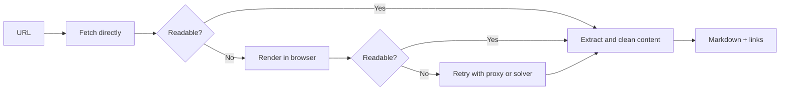

# OpenExtract

OpenExtract returns readable page content and links from a URL. It starts with direct HTTP and only escalates when the response looks like a JavaScript shell or block page.

The local extraction ladder is:

1. direct HTTP with Impit
2. local Patchright
3. Patchright with proxy and solver, when configured

Managed provider fallbacks belong to the calling application, not OpenExtract.

## Architecture



## Run

```sh
docker run --rm -p 8081:8081 ghcr.io/simonbalfe/openextract:latest
```

Images are published for `linux/amd64` and `linux/arm64`. Copy `.env.example` when enabling optional providers.

Set `OPENEXTRACT_PROXY_URL` to a standard `http://`, `https://`, `socks4://`, or `socks5://` proxy URL. Credentials belong in the URL. `OPENEXTRACT_PROXY_COUNTRY` optionally aligns the browser locale and timezone with a fixed proxy country.

Open [http://localhost:8081](http://localhost:8081) to test a URL and inspect its rendered and raw Markdown.

## API

Health check:

```sh
curl http://localhost:8081/healthz
```

Extract a page:

```sh
curl -X POST http://localhost:8081/extract \
  -H 'content-type: application/json' \
  -d '{"url":"https://example.com"}'
```

The response includes the extracted `content`, discovered `links`, selected `provider`, final `outcome`, and each attempted ladder rung.

## Develop

```sh
bun install --frozen-lockfile
bun run typecheck
bun test
docker build -t openextract .
```
